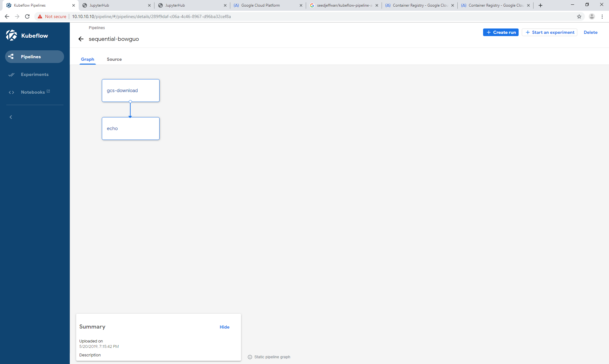

### Brief Introduction of [Kubeflow Pipeline](https://www.kubeflow.org/docs/pipelines/pipelines-overview/)

#### 1. What is Kubeflow pipeline?
* It is just like AML Studio experiment.

#### 2. What is Kubeflow [component](https://www.kubeflow.org/docs/pipelines/concepts/component/)?
* A pipeline has many components, and a component is just like a step in AML Studio experiment.

* A component has a **Docker image** (source codes) and an **interface**, which specifies the input/output

#### 3. How to write pipeline and component?
* Use [Kubeflow Pipelines SDK](https://www.kubeflow.org/docs/pipelines/sdk/), and follow the following steps.

**Step 1**: Put source code into a Docker image. To do that, first [install docker](https://docs.docker.com/docker-for-windows/install/). Then write a [Dockerfile](https://docs.docker.com/develop/develop-images/dockerfile_best-practices/). Build the docker image. 

**Step 2**: Register Docker image to [Dockerhub](https://cloud.docker.com/u/guobowen1990/repository/docker/guobowen1990/cnn-demo) or [GCR (Google Container Registry)](https://console.cloud.google.com/gcr/images/kubeflow-trial-241202?project=kubeflow-trial-241202&folder&organizationId)

Repeate Steps 1 and 2 for every component of pipeline, since every component needs a Docker image

**Step 3**: Now component part is almost done (not done yet).Then we need to write a **yaml file** as an **intermediate representation** of the pipeline.

* The yaml file is generated by Kubeflow Pipeline SDK, to be more specific, the [**kfp.dsl**](https://www.kubeflow.org/docs/pipelines/sdk/dsl-overview/) package. BTW, DSL stands for domain-specific language.
   
* Below is a small python program to demonstrate how to use SDK to generate yaml file. Basically this program does two things: 1. Define a component interface and 2. define a pipeline by connecting all the components.

* Then use the following command to generate the yaml file: demo.yaml

    dsl-compile --py [path/to/python/file] --output demo.yaml

**Step 4**: Now it is time to deploy the pipeline! To do that, simply upload the yaml file to Kubeflow UI, then you can see and run your pipeline.

